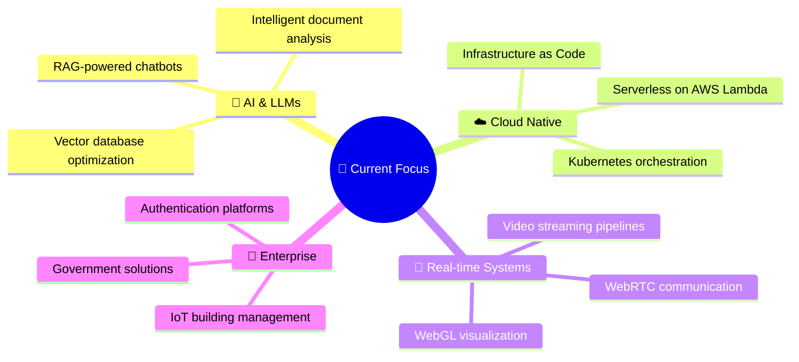

<div align="center">

<!-- Animated Header -->


<!-- Typing Animation -->
<a href="https://git.io/typing-svg"></a>

<br/>

[](https://linkedin.com/in/sheikharfazahamed)
[](https://sheikharfaz.com)
[](https://github.com/sheikharfaz)

<br/>


</div>

<br/>

<!-- About Section with Code Block -->
##  &nbsp;About Me

> _"Any sufficiently advanced technology is indistinguishable from magic."_ — Arthur C. Clarke

I'm a **Senior Software Engineer** with **7+ years** of experience building enterprise-grade solutions for **government organizations** and **Fortune 500** companies. I live at the intersection of **AI**, **Cloud Architecture**, and **Full-Stack Development** — turning complex problems into elegant, scalable systems.

```typescript
class SheikArfaz {
  readonly title = "Senior Software Engineer";
  readonly location = "Dubai, UAE 🇦🇪";

  get currentMission(): string[] {
    return [
      "🤖 Building AI-powered chatbots with RAG & LangChain",
      "🔐 Architecting enterprise security platforms",
      "🎥 Engineering real-time video streaming pipelines",
      "📚 Pursuing MBA in Business Analytics"
    ];
  }

  get expertise(): Record<string, string[]> {
    return {
      "Languages":    ["C#", "TypeScript", "Python", "JavaScript"],
      "Frontend":     ["React", "Next.js", "Angular", "Three.js"],
      "Backend":      [".NET Core", "FastAPI", "Node.js", "ASP.NET"],
      "AI & ML":      ["LangChain", "OpenAI", "RAG", "Vector DBs"],
      "Cloud & Ops":  ["AWS", "Azure", "Docker", "K8s", "Terraform"]
    };
  }
}
```

---

## 🛠️ Tech Arsenal

<div align="center">

**Languages**


**Frontend**


**Backend & APIs**


**AI / ML**


**Cloud & DevOps**


**Databases**


</div>

---

## 🚀 Featured Projects

<table>
<tr>
<td width="50%">

### 🤖 [RAG Chatbot Platform](https://github.com/sheikharfaz/chatbot)
**AI-Powered Document Intelligence**

Intelligent chatbot using **RAG + LangChain** with a cyberpunk-themed React/TypeScript frontend and FastAPI backend. Context-aware responses with real-time document upload and analysis.

`Python` `FastAPI` `React` `TypeScript` `LangChain`

</td>
<td width="50%">

### 🔐 [Central Auth System](https://github.com/sheikharfaz/central-auth)
**Enterprise Security Platform**

Centralized authentication with **OAuth 2.0 & JWT** serving multiple government clients. ASP.NET Core backend with secure session management and end-to-end encryption.

`ASP.NET` `C#` `.NET Core` `Azure` `OAuth 2.0`

</td>
</tr>
<tr>
<td width="50%">

### 🌐 [Portfolio v1](https://github.com/sheikharfaz/Portfolio)
**Modern Animated Portfolio**

Responsive portfolio with smooth **GSAP animations**, Swiper.js galleries, and mobile-first design. Interactive skills visualization and project showcase.

`HTML5` `CSS3` `JavaScript` `GSAP` `Swiper.js`

</td>
<td width="50%">

### ⚛️ [Portfolio v2 — React](https://github.com/sheikharfaz/Arfaz)
**Next-Gen 3D Portfolio**

Blazing-fast React + Vite portfolio featuring **3D star canvas with WebGL**, scroll progress indicators, and immersive animations powered by Three.js.

`React` `Vite` `Three.js` `WebGL` `ESLint`

</td>
</tr>
</table>

---

## 📊 GitHub Stats

<div align="center">


<br/>


</div>

---

## 🏆 Achievements

<div align="center">

| 🎖️ | Achievement | Details |
|:---:|:---|:---|
| 🏆 | **Team Player Award** | SL Kirloskar Software — 2020 |
| 🎯 | **Q4 Spot Award** | Exceptional technical innovation |
| 🚀 | **Gov't Project Lead** | End-to-end delivery of Dubai Government platforms |
| 📈 | **40% Perf Boost** | Angular migration optimization |
| 🤖 | **AI Pioneer** | First to integrate RAG in corporate security systems |

</div>

---

## 💡 What I'm Building Next



---

## 🤝 Let's Collaborate

<div align="center">

I'm passionate about building things that matter. If you're working on something exciting, let's talk!

**🤖 AI/ML & LangChain** · **☁️ Cloud-Native Apps** · **🌐 Full-Stack Projects** · **🔐 Security Systems** · **🌍 Open Source**

<br/>

[](https://linkedin.com/in/sheikharfazahamed)
[](https://sheikharfaz.com)

<br/>

<!-- Activity Graph -->


<!-- Footer Wave -->


_⭐ If you like what you see, consider giving my repos a star!_

</div>
